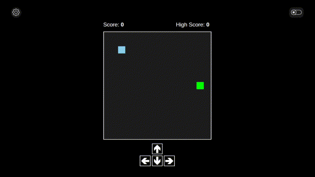

# Trail Builder

Trail Builder is a browser-based snake-like game where you collect items and grow your trail block by block.  
Built with **HTML, CSS, and JavaScript**, this was my first full project using **HTML Canvas**.

---

## Features

- Smooth movement mechanics
- Trail growth on item collection
- Collision detection with walls and self
- Score tracking
- Multiple keys for movement
- Win by reaching the maximum trail length

---

## Technologies Used

- HTML5 Canvas
- CSS3
- JavaScript (ES6)
- Webpack (for bundling)

---

## How to Play

Move your trail using the following keys:

| Direction | Keys                  |
| --------- | --------------------- |
| Up        | W, ↑ (Up Arrow), 8    |
| Right     | D, → (Right Arrow), 6 |
| Down      | S, ↓ (Down Arrow), 2  |
| Left      | A, ← (Left Arrow), 4  |

- Avoid hitting yourself or the walls.
- Collect items to grow your trail block by block.
- Win by reaching the **maximum trail length**.

---

## Author - Xeno

---
